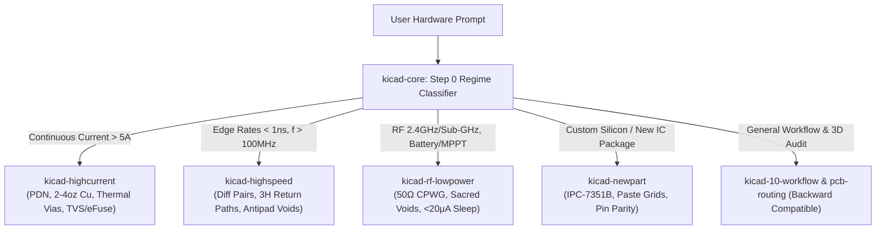

# Agentic KiCad Skills ⚡🛠️

> **Production-grade AI agent skills, automation scripts, and DFM design rules for modern KiCad 10 electronics engineering.**

[](https://kicad.org/)
[](LICENSE)
[](#system-requirements)
[](https://jlcpcb.com/)
[](evals/README.md)

---

## 🎯 Overview

Designing printed circuit boards with AI coding agents (Claude Code, Google Antigravity, Cursor, Codex) often suffers from coordinate hallucination, blind trace routing, acid traps, and violated return paths. Recent academic research (*PCBWorld-Bench, arXiv:2607.05915, 2026*) proves that direct LLM emission of track geometry fails at scale on complex boards without deterministic rule systems.

This repository provides **modular agent skills**, **closed-loop routing primitives**, and **deterministic verification scripts** that transform LLMs into rigorous hardware engineering partners. It bridges natural language intent with machine-verified `.kicad_sch` and `.kicad_pcb` hardware.

---

## 🏛️ Modular Skill Architecture (v2.0)

Skills are structured into a universal foundation hub (`kicad-core`) and targeted domain packs, ensuring agents load only the context needed for a specific board regime:



---

## 📦 What's Included

### 1. Universal Hub & Core Skills (`skills/`)

| Skill | Description | Key Focus Areas |
| :--- | :--- | :--- |
| [`kicad-core`](skills/kicad-core/SKILL.md) | **Step 0 Board Regime Classifier** & universal stackup engine. | Mandatory pre-design classifier, regime-driven 4/6-layer stackup matrix (JLC04161H-7628 vs JLC04161H-3313 2oz), JLCPCB DFM baseline constraints, and Routing Decision Ladder. |
| [`kicad-highcurrent`](skills/kicad-highcurrent/SKILL.md) | High-current power electronics & ASIC miner PDN. | Multi-stage chained DC-DC power domains ($<15\,\text{mV}$ IR drop), 2oz/3oz/4oz copper width tables (IPC-2152), thermal via arrays ($1.5\text{--}2.0\,\text{A}$/via), XT60PW-M right-angle layout, SMDJ15A TVS crowbar, and TI TPS25982 eFuse (banning PPTCs on $>5\,\text{A}$ rails). |
| [`kicad-highspeed`](skills/kicad-highspeed/SKILL.md) | High-speed digital & controlled impedance. | USB 2.0 ($90\,\Omega$) / USB 3.0, Ethernet RMII/RGMII ($100\,\Omega$, 50 MHz clock termination), continuous ground plane references, $3H$ via antipad clearance voids, and magnetics chassis isolation. |
| [`kicad-rf-lowpower`](skills/kicad-rf-lowpower/SKILL.md) | RF wireless antennas & ultra-low-power IoT. | 4-layer sacred antenna keepouts, $50\,\Omega$ Coplanar Waveguides with Ground (CPWG), via fence stitching, solar MPPT battery charging, and sub-$20\,\mu\text{A}$ deep sleep leakage budgeting. |
| [`kicad-newpart`](skills/kicad-newpart/SKILL.md) | Datasheet-to-footprint synthesis pipeline. | Parametric IPC-7351B package synthesis, thermal pad solder paste gridding ($50\%\text{--}65\%$ aperture coverage to prevent IC floating), and schematic-to-board pinout parity verification. |
| [`kicad-10-workflow`](skills/kicad-10-workflow/SKILL.md) | Standardizes KiCad 10 automation & 3-stage independent review. | S-expression headers, visual feedback loop (3D rendering), deterministic ERC/DRC quality gates, 3-Stage Multi-Persona Review Protocol, BoardRepo open-source reference retrieval. |
| [`pcb-routing-best-practices`](skills/pcb-routing-best-practices/SKILL.md) | Classic routing & physical layout index hub. | Backward-compatible master reference bridging all domain rules, return path physics, and connector outward orientation rules. |
| [`grill-me`](skills/grill-me/SKILL.md) | Relentless, round-based design tree interview. | Stress-test hardware architecture, PDN budgets, and layout decisions before committing copper. Supports **Standard** and **With-Docs** (`CONTEXT.md` sync) modes. |

---

### 2. Solvers, Routers & Verifiers (`tools/` & `scripts/`)

* **`tools/pcb_solver/route_and_verify.py`**: Closed-loop incremental 45° track router. Routes nets one-by-one, executes headless DRC after every modification, and automatically rolls back on violation.
* **`tools/pcb_solver/verify_layout_physics.py`**: Automated multi-layer 3D collision pre-flight gate. Detects cross-layer THT pin penetrations into opposite SMT pads ($\ge 1.5\,\text{mm}$ rule), RF antenna void breaches, M3/M2.5 standoff keepouts, and inward-facing connectors.
* **`tools/pcb_solver/generate_footprint.py`**: Parametric IPC-7351B footprint generator for custom SMD IC packages (QFN, DFN, SOIC, TSSOP, SOT) with automatic **thermal pad solder paste gridding** ($2\times 2$ / $3\times 3$ apertures).
* **`tools/pcb_solver/pcb_solver.py`**: Discrete PCB constraint optimizer powered by Google OR-Tools CP-SAT and KiCad 10 Python IPC bridge. Enforces `NoOverlap2D` bounding boxes and mechanical keepouts.
* **`tools/pcb_solver/astar_router.py`**: Algorithmic 8-directional $A^*$ prototype router with 90° corner penalties (reference implementation).
* **`scripts/render_3d.py`**: Automated high-resolution orthographic top, bottom, and isometric 3D board raytracer.
* **`scripts/run_quality_gates.py`**: Zero-tolerance ERC and DRC runner that refills copper zones, checks schematic-to-layout parity, and parses JSON reports.
* **`scripts/search_jlcpcb.py`**: Fast local CLI search engine for querying 630,000+ components in the JLCPCB/LCSC catalog.
* **`scripts/trace_calc.py`**: Pure Python terminal calculator for IPC-2152 trace sizing, thermal via arrays, and microstrip impedance.

---

### 3. Benchmarks & Evaluation (`evals/`)

* **`evals/run_pcbworld.py`**: Benchmark runner implementing the **PCBWorld-Bench** protocol across complexity tiers:
  - **D3-A** (1–10 nets)
  - **D3-B** (11–30 nets)
  - **D3-C** (>30 nets, dense multi-layer)
  Measures Clean Pass (CP) rate, total trace length, via efficiency, and categorizes DRC defects.
* **`evals/README.md`**: Evaluation methodology and benchmarking guide.

---

## 🚀 Quick Start & Installation

Install into your preferred AI agent environment using the universal installer:

```bash
# Clone the repository
git clone https://github.com/IxTechCrypto/kicad-skills.git
cd kicad-skills

# Install to BOTH Claude Code and Google Antigravity (Default)
python install.py

# Or install to Claude Code only (~/.claude/skills)
python install.py --claude

# Or install to Google Antigravity only (~/.gemini/config/skills)
python install.py --antigravity

# Or install to a specific project workspace
python install.py --dest ./my-hardware-project/.agents/skills
```

### Downstream Compatibility Notice
If you have an automated pipeline or another AI system pulling this repository on a regular schedule:
- **100% Backward Compatible:** Existing paths `skills/kicad-10-workflow` and `skills/pcb-routing-best-practices` remain intact as comprehensive entry points.
- **Auto-Discovery:** `install.py` dynamically indexes all skills in `skills/` and symlinks or copies them into your target environments.
- **Grilling Consolidation:** The standalone `grilling` and `grill-with-docs` folders have been consolidated into `skills/grill-me/` (with both modes preserved).

---

## 💡 Example Agent Prompts

Once installed, your AI agent can leverage these skills autonomously:

### 1. High-Current Power Stage Design
> *"Step 0: Classify this 12V-to-0.8V 25A continuous buck converter. Apply the kicad-highcurrent skill to size copper pours per IPC-2152, design a 2x6 thermal via array, and route high-frequency switching loops with zero DRC errors."*

### 2. High-Speed Digital Return Paths
> *"Audit this ESP32-S3 + Ethernet RMII layout using kicad-highspeed. Verify ground return path continuity under the 50 MHz clock line and check that via antipads do not breach the 3H clearance rule."*

### 3. RF & Low-Power Deep Sleep
> *"Design the RF front-end for a CC1352P sub-GHz sensor using kicad-rf-lowpower. Ensure 4-layer keepouts under the PCB inverted-F antenna, 50Ω CPWG feedline with ground stitching, and calculate standby current < 15µA."*

### 4. Custom IC Footprint Synthesis
> *"Generate an IPC-7351B compliant QFN-32 footprint for a new power controller with a 4.5x4.5mm exposed thermal pad. Use kicad-newpart to grid solder paste into a 3x3 array (60% coverage) to prevent floating."*

---

## 🛠️ System Requirements

* **KiCad EDA**: Version 10.0+ recommended (also compatible with KiCad 9.0 and 8.0).
* **Python**: 3.9+ (utilizes standard library `argparse`, `json`, `sqlite3`, `subprocess`, `shutil`).

---

## 🌟 Acknowledgments & Prior Art

See [**ATTRIBUTION.md**](ATTRIBUTION.md) for full citations.

* **[PCB Runner](https://www.pcbrunner.com/a-complete-guide-to-pcb-routing-design-rules-and-best-practices-for-success/#Ground_and_Power_Planes):** Formed the foundational signal integrity and PCB routing engineering rules.
* **[Altium Academy / Phil Salmony (Phil's Lab)](https://youtu.be/D0X76Kbf8fQ):** Reconciled $3H$ dielectric height crosstalk rule, via antipad clearance void keepouts, and low-inductance decoupling geometry.
* **[PCBWorld / PCBWorld-Bench (LG AI Research & Seoul National University)](https://arxiv.org/abs/2607.05915):** Benchmark methodology and empirical proof that deterministic routers + per-step DRC feedback outscale raw LLM geometry generation.
* **[mixelpixx/KiCAD-MCP-Server](https://github.com/mixelpixx/KiCAD-MCP-Server):** Local SQLite FTS5 JLCPCB catalog search architecture.
* **[BoardRepo](https://boardrepo.com/):** Web-based hardware repository and MCP platform for open-source reference design retrieval.
* **[KiCad EDA](https://kicad.org/):** The world-class open-source EDA suite.

---

## 📄 License

Distributed under the **MIT License**. See [LICENSE](LICENSE) for details.

Developed with ⚡ by **Ix Tech** ([support@ixtech.xyz](mailto:support@ixtech.xyz)).
